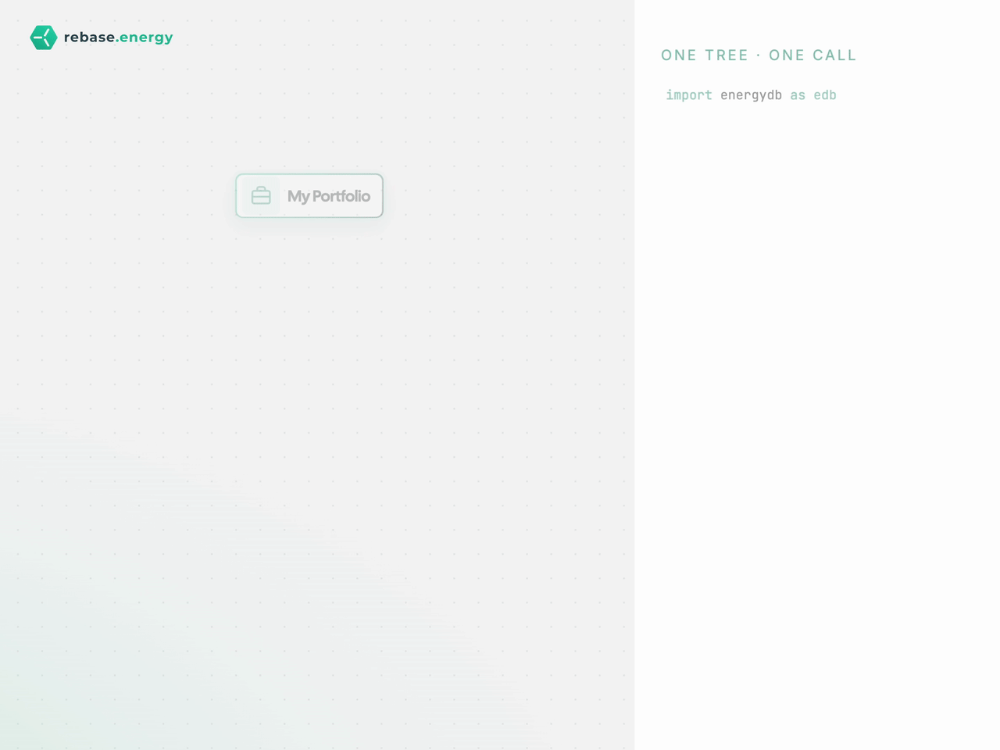

<div align="center">
  <h1>⚡ EnergyDB</h1>
  <p><b>Persistent storage for energy portfolios — assets, grid topology, and 3-dimensional time series, in one connected database.</b></p>

  <a href="https://pypi.org/project/energydb/"></a>
  <a href="https://pypi.org/project/energydb/"></a>
  <a href="https://github.com/rebase-energy/energydb/blob/main/LICENSE"></a>
  <a href="https://www.rebase.energy/join-slack"></a>
</div>

<br/>

## 🏗️ What is EnergyDB?

EnergyDB is a database for energy portfolios. It stores three things together in one connected system:

| Layer | Description | Real-World Example |
| :---- | :--- | :--- |
| 🌳&nbsp;**Asset hierarchy** | Arbitrary-depth tree of portfolios, sites, and assets | *"Offshore-1 → WindTurbine T01 → power"* |
| 🔗&nbsp;**Grid topology** | Typed edges (lines, transformers, pipes, interconnections) connecting any two assets | *"Cable-1: BusA → BusB"* |
| ⏱️&nbsp;**3-dimensional time series** | Actuals and versioned forecasts attached to any node or edge, queryable as-of any point in time | *"power_flow on Cable-1, valid Wed 12:00, known Mon 18:00"* |

Structure lives in PostgreSQL, values live in ClickHouse, and stable UUID identity lets Python objects round-trip to the database without losing any structural state.

EnergyDB extends [TimeDB](https://github.com/rebase-energy/timedb) with persistent storage for [EnergyDataModel](https://github.com/rebase-energy/energydatamodel) hierarchies.

---

## ✨ Why EnergyDB?

Most time-series systems are agnostic about what their series represent — they treat data as opaque `(series_id, timestamp, value)` triples. EnergyDB knows it is a portfolio, and links every series back to the asset or grid edge it describes.

- 🔁 **Round-trip persistence:** Every `Element` keeps its UUID7 from in-memory object to row primary key — renames, moves, and property edits become silent `UPDATE`s, never delete-then-insert.
- 📋 **Diffable structural changes:** `dry_run=True` previews every insert, rename, move, and delete as a `TreeDiff` before you apply — no surprise mutations, and the same preview is available across a whole `transaction()`.
- ⏱️ **Time-of-knowledge queries:** Forecast revisions, corrections, and as-of backtests, powered by [TimeDB](https://github.com/rebase-energy/timedb).
- 🧭 **Lazy fluent navigation:** `client.get_node("Portfolio", "Site", "T01").read(...)` resolves to one indexed SQL query, regardless of subtree size.
- ⚖️ **Unit conversion at the boundary:** Declare canonical units once; pint rescales every read and write automatically.
- 🧹 **Idempotent writes:** `write(..., skip_unchanged=True)` drops rows that only duplicate the latest stored value before insert, so writing the same window repeatedly doesn't bloat storage. The comparison key is chosen *per series* — actuals dedupe per `valid_time`, versioned forecasts per `(valid_time, knowledge_time)` — so a republished forecast is never mistaken for a duplicate. Opt-in; the write still returns its `run_id` (a `WriteResult` carrying `.written` / `.skipped` counts).
- 🎯 **Partial reads that don't fail:** `read(manifest, on_missing="skip")` returns every series that resolved plus the triples that didn't, so one unregistered series in a 1,500-series manifest costs you that series — not the whole batch.
- 🧯 **Typed errors:** `NodeNotFoundError`, `SeriesNotFoundError` (carrying every unresolved triple), `ManifestError`, … all under one `EnergyDBError` base — so you branch on types and structured fields instead of matching message text. Every class also subclasses `ValueError`, so broad handlers keep working.

---

<div align="center">
  <p></p>  
</div>

---

## 🚀 Quick Start

### 1. Installation

```bash
pip install energydb
```

Requires Python 3.12+, PostgreSQL (asset hierarchy + series catalog), and ClickHouse (time-series values).

> **Need a local Postgres + ClickHouse?** One command brings both up: `cd local-db && docker compose up -d` (see [`local-db/`](local-db/), or [DEVELOPMENT.md](DEVELOPMENT.md) for the full setup).

### 2. Usage Example

```python
from datetime import UTC, datetime
import energydb as edb
import pandas as pd

client = edb.Client()  # reads TIMEDB_PG_DSN / TIMEDB_CH_URL
client.create()

# 1. Declare your portfolio: a tree of typed assets with their series.
t01 = edb.wind.WindTurbine(
    name="T01", capacity=3.5, hub_height=80,
    timeseries=[edb.TimeSeries(name="power", unit="MW",
                               data_type=edb.DataType.ACTUAL)],
)
portfolio = edb.Portfolio(
    name="my-portfolio",
    members=[edb.Site(name="Offshore-1", members=[t01])],
)
client.register_tree(portfolio)   # create-only; edit existing nodes via scope mutators

# 2. Write hourly power for that turbine.
start = datetime(2026, 1, 1, tzinfo=UTC)
df = pd.DataFrame({
    "valid_time": pd.date_range(start, periods=24, freq="1h", tz="UTC"),
    "value":      [2.5 + 0.05 * i for i in range(24)],
})
client.get_node("my-portfolio", "Offshore-1", "T01").write(
    df, name="power", data_type="actual",
)

# 3. Read across the whole portfolio in one fluent call.
client.get_node("my-portfolio").read(name="power", data_type="actual")
```

> **Async?** `edb.Client` is a synchronous facade over `edb.AsyncClient`. For
> `async`/`await` code, use `AsyncClient` directly — `await client.open()`
> once, then `await` every method shown above.

---

## 🧪 Try it in Google Colab

Want to try EnergyDB without a local setup? Open our Quickstart in Colab — the first cell automatically installs PostgreSQL + ClickHouse inside the VM.

[](https://colab.research.google.com/github/rebase-energy/energydb/blob/main/examples/quickstart.ipynb)

> **Note:** Data persists only within the active Colab session. Additional notebooks are available in the `examples/` directory.

---

## 📚 Documentation & Resources

- [📖 Official Documentation](https://energydb.readthedocs.io)
- [⚙️ Installation Guide](https://energydb.readthedocs.io/en/latest/installation.html)
- [🐍 Python SDK Documentation](https://energydb.readthedocs.io/en/latest/sdk.html)
- [🌐 Reference](https://energydb.readthedocs.io/en/latest/reference.html)
- [💡 Examples & Notebooks](examples/)

---

## 📦 Related Projects

| Project | Description |
| :------ | :---------- |
| [TimeDB](https://github.com/rebase-energy/timedb) | 3-dimensional time-series storage on ClickHouse with auditability and overlapping-forecast support |
| [TimeDataModel](https://github.com/rebase-energy/timedatamodel) | Pythonic data model for time series |
| [EnergyDataModel](https://github.com/rebase-energy/energydatamodel) | Data model for energy assets (solar, wind, battery, grid, ...) |

---

## 🤝 Contributing

Contributions are welcome! If you're interested in improving EnergyDB, please see our [Development Guide](DEVELOPMENT.md) for local setup instructions.

---

<div align="center">
<p>Licensed under the <a href="LICENSE">Apache-2.0 License</a>.</p>
<p>Find a bug or have a feature request? <a href="https://github.com/rebase-energy/energydb/issues">Open an Issue</a>.</p>
</div>
